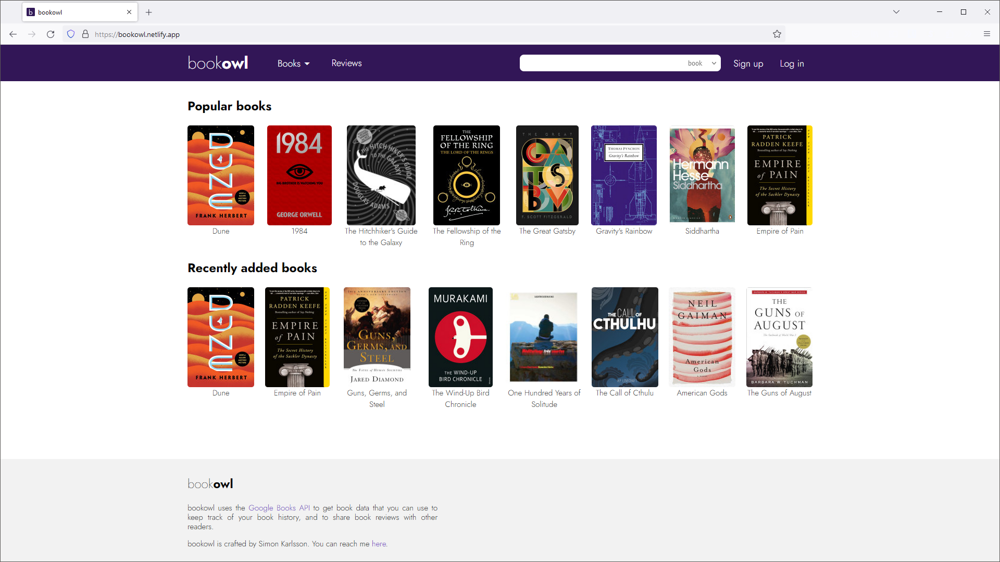

# bookowl

A web app to track your book history, including current reads, completed books, and future reading 
goals. Engage with the community by sharing your book reviews and exploring what others are reading.

Visit the site [here](https://bookowl.netlify.app/).

## Table of Contents
* [General Info](#general-information)
* [Built With](#built-with)
* [Features](#features)
* [Screenshots](#screenshots)
* [Setup](#setup)
* [Usage](#usage)
* [Contact](#contact)

## General Information
This project is the frontend for the web app [bookowl](https://bookowl.netlify.app/). The backend 
is available in [this GitHub repository](https://github.com/sim-kar/bookowl-backend).

The app was built with Angular to provides a user-friendly interface and features a
secure registration and login system. Users can not only discover new books, but also keep track
of their entire reading history, rate books and share reviews, and see what others are reading and 
which books are popular at the moment.

This project aimed to enhance skills in full-stack web development, using the MEAN tech stack 
(MongoDB, Express, Angular, Node.js). It utilizes a self-developed REST API and also connects to an 
external API in GoogleBooks for extended functionality.

## Built With
- TypeScript
- HTML/CSS
- Angular
- JSON Web Token

## Features
- User registration and login system
- Search for books or authors
- Personal bookshelf for tracking reading history
- Ability to rate books and share reviews
- View popular and highly-rated books

## Screenshots

## Setup
For all project dependencies see *package.json*.

To get the project up and running, you need:

- Node.js (16) and NPM
- Angular (13)

Instructions:

- Clone the repo from GitHub
- Navigate to project directory
- Run `npm install` to install dependencies
- Run `ng serve` to start a dev server at `http://localhost:4200/`
- To build the app for deployment, run `ng build`. The built project can be found in the `dist` 
  directory

## Usage
This project was built to use the API endpoints provided by its corresponding 
[backend](https://github.com/sim-kar/bookowl-backend). 

If you want to communicate with your own local or deployed backend, change the adress assigned to
`apiBaseURL` in *environments/environment.ts* or *environments/environment.prod.ts*, repectively.

## Contact
Created by [Simon Karlsson](mailto:a.simon.karlsson@gmail.com) - feel free to contact me!
